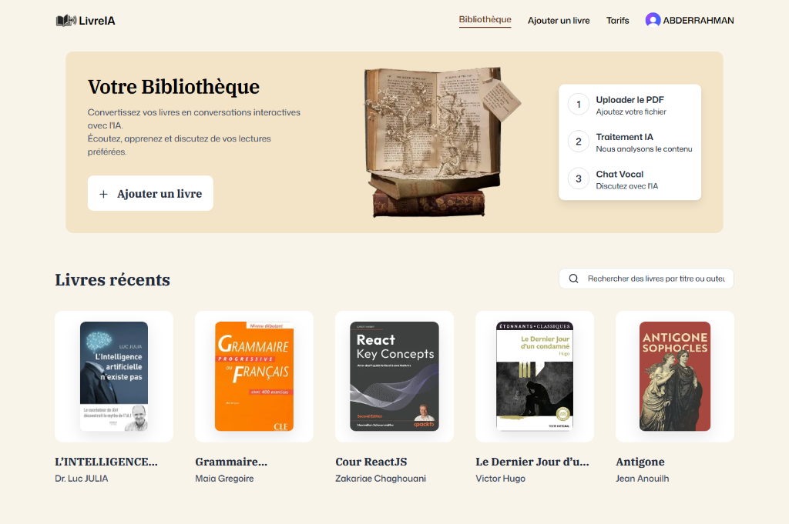

<div align="center">
  

  <h1>📚 LivreIA</h1>
  <p><strong>Transform your reading experience with AI-powered voice conversations.</strong></p>

  <p>
    <a href="https://livreia.vercel.app">Live Demo</a> •
    <a href="#features">Features</a> •
    <a href="#tech-stack">Tech Stack</a> •
    <a href="#installation">Installation</a>
  </p>
</div>

---

## 📖 Introduction

**LivreIA** is a modern, AI-driven web application that revolutionizes how we interact with books and documents. Instead of just reading, LivreIA allows you to upload your PDF documents and have real-time, natural voice conversations with their content. Powered by advanced LLMs and Voice AI, it understands context and responds intelligently, making learning and reading more interactive than ever.

## 📑 Table of Contents

- [Features](#-features)
- [Tech Stack](#-tech-stack)
- [Project Structure](#-project-structure)
- [AI Workflow](#-ai-workflow)
- [Installation](#-installation)
- [Environment Variables](#-environment-variables)
- [Usage](#-usage)
- [Screenshots](#-screenshots)
- [Live Demo](#-live-demo)
- [Author](#-author)
- [License](#-license)

## ✨ Features

- **🔐 Secure Authentication:** Seamless user sign-up and login powered by Clerk.
- **📤 Document Upload:** Easily upload and manage your PDF books and documents.
- **🎙️ Interactive Voice Assistant:** Talk to your books! The AI understands the document's context and replies with ultra-realistic voices.
- **🎨 Modern UI/UX:** A beautiful, responsive interface built with Tailwind CSS and Shadcn UI, featuring full Dark/Light mode support.
- **💳 Subscription Management:** Tiered access (Free, Standard, Pro) managed directly through Clerk's RBAC.
- **⚡ Fast & Scalable:** Built on Next.js 16 App Router for optimal performance and SEO.

## 🛠 Tech Stack

### Frontend
- **[Next.js (v16)](https://nextjs.org/):** React framework for server-side rendering and static site generation.
- **[React (v19)](https://react.dev/):** UI library for building component-driven interfaces.
- **[Tailwind CSS (v4)](https://tailwindcss.com/):** Utility-first CSS framework for rapid styling.
- **[Shadcn UI](https://ui.shadcn.com/):** Accessible and customizable UI components.

### Backend & Database
- **Next.js API Routes & Server Actions:** For secure backend logic and data mutations.
- **[MongoDB](https://www.mongodb.com/) & [Mongoose](https://mongoosejs.com/):** NoSQL database and object modeling for storing user and book metadata.
- **[Vercel Blob](https://vercel.com/docs/storage/vercel-blob):** Secure cloud storage for uploaded PDF files.

### AI & Voice Integrations
- **[Vapi](https://vapi.ai/):** Core Voice AI engine for real-time conversational interactions.
- **[Google Gemini](https://deepmind.google/technologies/gemini/):** Advanced LLM for deep text comprehension and context generation.
- **[ElevenLabs](https://elevenlabs.io/):** Ultra-realistic voice synthesis for the AI assistant's responses.

### Authentication & Deployment
- **[Clerk](https://clerk.com/):** Comprehensive user authentication and subscription role management.
- **[Vercel](https://vercel.com/):** Cloud platform for seamless deployment and hosting.

## 📂 Project Structure

```text
livreia/
├── app/                  # Next.js App Router (Pages, API routes, Layouts)
│   ├── (auth)/           # Authentication routes (Sign-in, Sign-up)
│   ├── (root)/           # Main application routes (Dashboard, Books, Subscriptions)
│   └── api/              # Backend API endpoints (Upload, Vapi webhooks)
├── components/           # Reusable React components (UI, Forms, VapiControls)
├── lib/                  # Utility functions, Server Actions, and Constants
├── models/               # Mongoose database schemas
├── public/               # Static assets (Images, Icons)
└── package.json          # Project dependencies and scripts
```

## 🧠 AI Workflow

1. **Document Processing:** When a user uploads a PDF, it is securely stored in Vercel Blob. The text is extracted and processed to build context.
2. **Contextualization:** The extracted content is fed into the Google Gemini LLM, allowing the AI to understand the specific knowledge within the book.
3. **Voice Interaction:** The user speaks their question. Vapi captures the audio and processes the speech-to-text.
4. **Intelligent Response:** The LLM generates a context-aware answer based on the book's content.
5. **Voice Synthesis:** ElevenLabs synthesizes the text response into a natural-sounding voice, which Vapi streams back to the user in real-time.

## 🚀 Installation

1. **Clone the repository:**
   ```bash
   git clone https://github.com/yourusername/livreia.git
   cd livreia
   ```

2. **Install dependencies:**
   ```bash
   npm install
   ```

3. **Set up environment variables:**
   Create a `.env.local` file in the root directory and add the required keys (see below).

4. **Run the development server:**
   ```bash
   npm run dev
   ```
   Open [http://localhost:3000](http://localhost:3000) in your browser to see the application.

## 🔐 Environment Variables

Create a `.env.local` file in the root of your project and add the following variables. **Do not commit this file to version control.**

```env
# Clerk Authentication
NEXT_PUBLIC_CLERK_PUBLISHABLE_KEY=pk_test_...
CLERK_SECRET_KEY=sk_test_...
NEXT_PUBLIC_CLERK_SIGN_IN_URL=/sign-in
NEXT_PUBLIC_CLERK_SIGN_UP_URL=/sign-up
NEXT_PUBLIC_CLERK_SIGN_IN_FALLBACK_REDIRECT_URL=/
NEXT_PUBLIC_CLERK_SIGN_UP_FALLBACK_REDIRECT_URL=/

# Database
MONGODB_URI=mongodb+srv://<username>:<password>@cluster.mongodb.net/livreia

# Storage (Vercel Blob)
BLOB_READ_WRITE_TOKEN=vercel_blob_rw_...
BLOB_STORE_ID=...

# AI & Voice Services
NEXT_PUBLIC_VAPI_PUBLIC_KEY=...
VAPI_SERVER_SECRET=...
NEXT_PUBLIC_ASSISTANT_ID=...
ELEVENLABS_API_KEY=...
GOOGLE_GEMINI_API_KEY=...

# App Config
NEXT_PUBLIC_BASE_URL=http://localhost:3000
NODE_ENV=development
```

## 💡 Usage

1. **Sign Up / Log In:** Create an account using Clerk authentication.
2. **Upload a Book:** Navigate to the "Ajouter un livre" (Add a book) section and upload a PDF document.
3. **Start Chatting:** Open the book from your library and click the microphone icon to start a voice conversation with the AI about the book's content.
4. **Manage Subscription:** Visit the pricing page to view or upgrade your current plan limits.

## 📸 Screenshots

<div align="center">
  
  <p><em>The main dashboard showing the user's library and recent books.</em></p>
</div>

## 🌐 Live Demo

Check out the live application here: **[LivreIA on Vercel](https://livreia.vercel.app)**

## 👨‍💻 Author

**Abderrahman**
- GitHub: [@yourusername](https://github.com/yourusername)
- LinkedIn: [Your Profile](https://linkedin.com/in/yourprofile)

## 📄 License

This project is licensed under the MIT License - see the [LICENSE](LICENSE) file for details.
